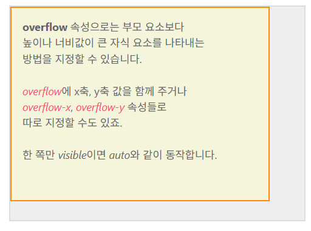
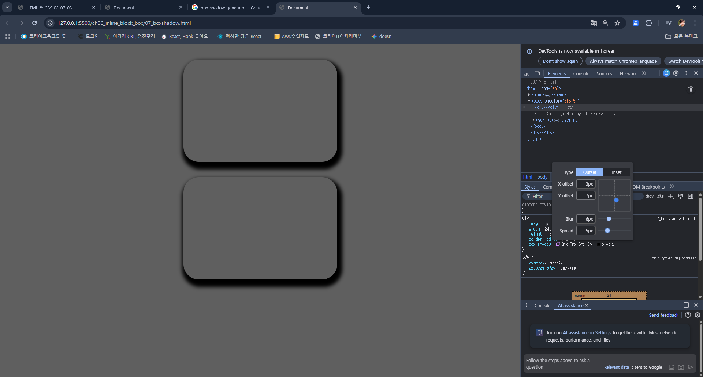

# 입실 체크 해주세요 !! 🎈

### box-sizing
https://showcases.yalco.kr/html-css/02-07/01.html

box-sizing 속성은 속성값으로
  1. content-box : padding(안쪽 여백)을 제외하고 텍스트 / 이미지 등의 내용이 들어갈 수 있는 영역만 계산함. 예를 들어 div의 width가 440px이라면 내용이 들어갈 수 있는 가로 길이가 440px이라는 의미.
  2. border-box : padding을 포함한 영역으로 좌측 여백 + 컨텐츠 영역 + 우측 여백을 합쳐서 div의 width가 결정됨. box-sizing을 border-box로 설정하고, width를 440px로 지정했다면 24(좌측여백) + 24(우측여백) + 392(컨텐츠영역) = 440으로 결정남. 그리고 추가적으로 외곽선(border)까지 지정했다면, 좌측외곽선 + 좌측여백 + 컨텐츠영역 + 우측여백 + 우측외곽선으로 결정남.

  지금 제가 위에서 div 요소라고만 이야기하고 있지만, div 태그의 원래 성격이 인위적으로 가로세로길이를 지정할 수 있기 때문이라는 점도 명심하셔야합니다.

### border-radius
1. 값을 하나만 주는 방법 : 네 군데 모서리에 모두 적용됨.
2. 값을 두 개로 주는 방법 : 첫 번째 속성값은 상단 왼쪽과 하단 오른쪽 / 두 번째 속성값은 상단 오른쪽 / 하단 왼쪽
3. 값을 네 개로 지정하는 경우 : 왼쪽 상단 모서리부터 시계방향으로 결정남.
https://showcases.yalco.kr/html-css/02-07/01.html 에서 확인하시기 바랍니다.

06_borderradius.html / css 생성

힌트 # 1 : 정사각형이어야 합니다.
힌트 # 2 : border 관련 속성을 지정해야 됩니다.
힌트 # 3 : 제일 편하게 하려면 곡률을 % 상대값으로 줘야 합니다. -> 50%

이상의 경우에서 border 속성을 주석 처리 했을 때
```html
<!DOCTYPE html>
<html lang="en">
<head>
  <meta charset="UTF-8">
  <meta name="viewport" content="width=device-width, initial-scale=1.0">
  <title>Document</title>
  <style>
    div {
      width: 200px;
      height: 200px;
      border: 5px solid black;
      box-sizing: border-box;
      border-radius: 50%;
      background-color: antiquewhite;
    }
  </style>
</head>
<body bgcolor="5f5f5f">
  <h1>06_borderradius.html</h1>
  <div></div>
</body>
</html>
```
이상의 경우에서 border 속성을 주석처리했을 때 조금씩 위치가 이동하는 것을 봤을 때, box-sizing의 default 값은 뭐라고 해석할 수 있을까요? -> content-box

### overflow
- 부모 요소보다 높이나 너비가 큰 자식 요소를 나타내는 방법을 지정하는 속성.
https://showcases.yalco.kr/html-css/02-07/02.html


- overflow의 기본 속성값은 default로 auto로 잡혀있습니다.
  - auto : 자식 요소가 부모의 요소보다 큰 경우 스크롤바를 자동 생성
  - visible : 부모 영역을 벗어난 자식 요소를 그대로 보여주도록 허용(부모 요소의 크기를 무시하고 자식 요소를 전체 다 보여줍니다).
    - visible 속성은 가로세로를 전부 지정해줘야 합니다. 한쪽만 지정할 경우 auto와 동일한 결과값을 얻게 됩니다.
  - hidden : 부모 영역을 벗어나는 부분은 아예 보이지 않도록 합니다.
  - scroll : auto와 동일하게 영역을 넘어가는 가로세로 지점에 스크롤바를 생성하는데, 차이점으로는 자식 영역이 부모의 영역을 넘어가지 않더라도 일단 스크롤바를 보여줍니다.
- 속성값 두개 입력할 수도 있는데 첫번째가 x축 / 두번째가 y축에 해당
- overflow-x : 가로 부분
- overflow-y : 세로 부분

## 박스 그림자
https://showcases.yalco.kr/html-css/02-07/03.html
형식 :
div {
  box-shadow: (inset 여부) offset-x(x축 두께) offset-y(y축 두께) (blur-radius)(퍼짐효과 크기) (spread-radius)(그림자크기) color
}

실수값이 두 개 일 때 : x축 두께 / y축 두께
실수값이 세 개 일 때 : x축 두께 / y축 두께 / 퍼짐효과크기
실수값이 네 개 일 때 : x축 두께 / y축 두께 / 퍼짐효과크기 / 그림자 크기 지정

spread-radius는 그림자 크기를 지정하기 때문에 양수값을 입력하게 되면 상자보다 더 큰 크기의 그림자가 생성됩니다. 반면에 음수값을 입력하게 될 경우에는 그림자 크기가 상자보다 더 작아집니다.
inset 효과 : 박스 안쪽에 그림자가 생깁니다.

너무 복잡하면 chrome에서 box-shadow generator를 검색하세요.
07_boxshadow.html / css 생성


개발자 도구 상에서 임의적으로 css 수정을 해볼 수 있습니다. style 파트에 box-shadow 부분을 확인하시면 아이콘 하나 떠있습니다.

ch07_color_image
# 색 / 페이지로 웹페이지 꾸미기
# 색 표현하기
## 색을 표현하는 방법
### keyword
- 특정 색상의 이름을 키워드로 입력하는 방법으로 red / green / yellow 등
- 대표 색상의 keyword는 css color mdn을 검색하시면 됩니다.
### rgb / rgb(a)
- 빛의 3원색에 해당하는 red / green / blue를 조합해 색상을 나타내는 방식으로 각 색의 수치를 숫자 혹은 퍼센트를 사용하여 표시합니다. 0 ~ 255까지 있습니다. 정수값 255는 100%를 의미합니다.
- rgb(a)의 a는 알파값으로 불투명도를 나타냅니다(opacity).

### HEX
16진수로 색상을 표기하는 방식으로 저희는 5f5f5f를 썼습니다.
저희는 Java에서 객체의 주소값 할 때 본 적이 있습니다.
0123456789 - 10개의 숫자
0123456789abcdef - 16진수
#ffffff - 지금 .md에서 표시되듯이 흰색입니다. = rgb(255, 255, 255)
rba(a)와 마찬가지로 맨 마지막에 0 ~ 99를 통해서 불투명도 지정이 가능합니다.

### HSL(A)
색상, 채도, 명도값 알파값을 조합하여 색을 나타냅니다.
채도 : 색이 얼마나 분명하게 나타나는지
명도 : 색의 밝은 정도를 의미함.
근데 얘는 색상의 라인이 무지개색처럼 빨주노초파남보 색 거친 다음에 다시 빨간색으로 되돌아가서 360도 회전하는 것처럼 여겨집니다.

01_csscolor.html
# 배경 꾸미기
## 이미지를 배경에 사용하기
https://showcases.yalco.kr/html-css/02-08/01.html
배경은 넣고자 하는 이미지 파일을 그대로 삽입하거나 해당 이미지에 CSS로 다양한 효과를 적용하는 것이 가능합니다.
### background-image
- 배경에 특정 이미지를 삽입하고 싶다면 background-image 속성을 이용할 수 있는데, 해당 이미지가 있는 절대/상대 주소값을 url값으로 지정합니다. url(주소값) 형태로 작성하기 때문에 함수/method처럼 보이기도 합니다.
### background-repeat
- 배경 크기가 삽입한 이미지보다 큰 경우 삽입한 이미지를 가로세로로 반복해서 나타나게 합니다. repeat이 default값입니다.
- 속성값 목록
  1. repeat :알아서 반복됨
  2. no-repeat : 이미지가 한 번만
  3. repeat-x : x축으로만 반복
  4. repeat-y : y축으로만 반복
  5. space : 잘 안쓰이는데 이미지를 각 모서리에 먼저 배치한 다음에 남는 공간을 알아서 계산해서 일정한 간격을 두고 배치합니다.
  6. round : 배경의 최대 너비와 높이에 맞춰서 그냥 적절하게 계산해서 맞춰줍니다. repeat은 기본 이미지 크기를 그대로 반영하기 때문에 잘리는 부분이 생기는 반면에 round는 이미지 사이즈를 좀 바꿉니다.
  7. 응용도 가능합니다. background-repeat: repeat space;와 같은 식으로 x축 / y축 두 개의 값을 줄 수도 있습니다. 이상의 코드는 x축은 repeat이고 y축은 space가 적용됐다고 볼 수 있습니다.
### background-position
  1. %값 : 이미지의 중심축이 되는 배경의 어느 시점에 위치해야할지를 결정할 수 있음. 50% / 50% 로 정했을 때 가로축 50% 지점, 세로축 50% 지점이기 때문에 center로 지정한 것과 동일한 효과를 가지게 됩니다.
  2. vw / vh / vmax / vmin도 가능합니다.
  3. 특정 위치를 조합하여 사용하는 것도 가능합니다.

### background-size
  1. contain : 이미지의 비례와 상관없이 자연스럽게 배경에 맞춰서 이미지를 나타냄.
    - 여백이 있을 수 있음.
  2. cover : 여백없이 꽉 채우는 형태(div에 따라서 이미지가 잘릴 수 있음)